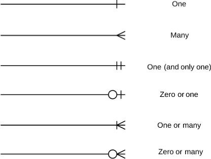

## **Введение в UML**
  UML (Unified Modeling Language) – это стандартный язык для создания диаграмм, позволяющий представить систему на разных уровнях абстракции и с разных точек зрения. <br>
  UML помогает в визуализации, спецификации, конструировании и документировании артефактов системного процесса.
    Краткий обзор основных типов диаграмм UML и их назначения, включая структурные, поведенческие и взаимодействий.

  Помнить соотношение этапов разработки и диаграмм (некоторые можно делать на любом из этапов, просто будет разный уровень абстракции)

## **Обзор основных диаграмм UML**

- **Диаграммы вариантов использования *(Use Case Diagram)*.** Показывают, как "актеры/акторы/экторы" взаимодействуют с системой. <br>
[Пример и мотивация](https://habr.com/ru/companies/qiwi/articles/346438/) <br>
[Как можно оформлять описание](https://docs.google.com/document/d/1riUHc4EkpK7hQduTxSKkuRRWxTV19VpW/edit)

- **Диаграммы классов *(Class Diagram)*.** Отражают структуру системы, показывая классы, их атрибуты, методы и отношения между ними.
<br>[Пример](https://habr.com/ru/articles/511798/) 


- **Диаграммы Сущностей *(ERD)*.**


- **Диаграммы последовательности *(Sequence Diagram)*.** Они иллюстрируют взаимодействие между объектами во времени. В основном, это диаграммы взаимодействия, которые отображают, как сообщения передаются между объектами в определенной последовательности. Для каждого объекта строится своя временная шкала событий. 

- **Диаграммы активностей *(Activity Diagram)*.** Диаграммы активностей похожи на блок-схемы и показывают поток управления и поток данных в системе. Они отлично подходят для представления бизнес-процессов или рабочего потока системы. 
<br>[YouTube Activity Diagram](https://www.youtube.com/watch?time_continue=285&v=Z8PHBsNXAgc&embeds_referring_euri=https%3A%2F%2Fwww.google.com%2Fsearch%3Fq%3Duml%2B%25D0%25B4%25D0%25B8%25D0%25B0%25D0%25B3%25D1%2580%25D0%25B0%25D0%25BC%25D0%25BC%25D0%25B0%2B%25D1%2581%25D0%25BE%25D1%2581%25D1%2582%25D0%25BE%25D1%258F%25&source_ve_path=MjM4NTE&feature=emb_title&ab_channel=%D0%90%D0%B2%D0%B5%D0%9A%D0%BE%D0%B4%D0%B5%D1%80) 
<br>[Пример](https://habr.com/ru/articles/448146/) 

<br>[Завершение примера](https://habr.com/ru/articles/448186/)

### Всё вместе: https://habr.com/ru/companies/ppr/articles/491146/ 
<br>

- **Диаграммы состояний**: Диаграммы состояний идеально подходят для описания жизненного цикла объекта. Они позволяют показать, как объект меняет свои состояния, какие события вызывают эти переходы, а также какие действия выполняются при вхождении в состояние или выходе из него. 

 - Остальные типы диаграмм: диаграммы компонентов, развертывания и т.д. 


## **Диаграммы на практике (урок рисования)**

- **Моделирование простого сценария с использованием различных диаграмм UML**: Моделирование процесса заказа в интернет-магазине, который включает в себя широкий спектр действий и интеракций, что позволит нам использовать множество различных типов UML диаграмм.

    - Сначала, мы создадим диаграмму вариантов использования, чтобы выделить основные актеры (покупатель, система) и их цели (выбрать товар, добавить в корзину, оформить заказ).
  
    - Затем, на основе этого сценария, мы создадим диаграмму классов, которая будет показывать структуру объектов (Клиент, Товар, Корзина, Заказ и т.д.) и отношения между ними.
    
    - Диаграмма последовательности покажет, как проходит взаимодействие между этими объектами во времени (поиск товара, добавление в корзину, оформление заказа).
    
    - Мы также можем создать диаграмму активности, чтобы показать поток действий, который должен выполнить покупатель для оформления заказа.
<br>
<br>

### **Диаграмма вариантов использования**:

1. **Вариант использования "Просмотр товаров" (Browse Products)**:

   * **Актор**: Покупатель
   * **Описание**: Покупатель может просматривать доступные товары в интернет-магазине. Это может включать просмотр деталей отдельного товара, просмотр списка товаров, поиск товаров и фильтрацию товаров по различным параметрам (например, цене, категории).
   * **Сценарий**: 
     1. Покупатель открывает каталог товаров.
     2. Покупатель выбирает категорию товара или использует функцию поиска для нахождения конкретного товара.
     3. Система представляет список подходящих товаров с изображениями и базовой информацией о каждом товаре.
     4. Покупатель может выбрать конкретный товар, чтобы увидеть более подробную информацию.

2. **Вариант использования "Добавить в корзину" (Add to Cart)**:

   * **Актор**: Покупатель
   * **Описание**: Покупатель может добавить выбранный товар в свою корзину для последующего оформления заказа. Это включает выбор количества товара и, возможно, других параметров (например, размера или цвета в случае одежды).
   * **Сценарий**: 
     1. Покупатель выбирает товар, который хочет купить, и переходит на страницу этого товара.
     2. Покупатель выбирает нужное количество товара и нажимает на кнопку "Добавить в корзину".
     3. Система добавляет товар в корзину Покупателя и обновляет информацию о корзине.
   * **Связи**: 
     - **Включает**: "Просмотр товаров". Перед тем, как добавить товар в корзину, Покупатель должен выбрать этот товар, просматривая товары.


3. **Вариант использования "Оформить заказ" (Checkout)**:

   * **Актор**: Покупатель
   * **Описание**: Покупатель хочет завершить покупку и переходит к процессу оформления заказа. В этом процессе ему представляется итоговая стоимость покупки, включая налоги и стоимость доставки, а также информация о выбранных товарах. После проверки всех данных, Покупатель подтверждает заказ и переходит к оплате.
   * **Сценарий**: 
     1. Покупатель переходит к оформлению заказа.
     2. Система представляет общую стоимость заказа, информацию о товарах и варианты оплаты.
     3. Покупатель подтверждает заказ и выбирает способ оплаты.
     4. Система перенаправляет Покупателя к системе оплаты.
   * **Связи**: 
     - **Включает**: "Добавить в корзину". Перед оформлением заказа Покупатель должен добавить товары в корзину.
     - **Расширяет**: "Обработка платежа". После подтверждения заказа система перенаправляет Покупателя к системе обработки платежей.

4. **Вариант использования "Обработка платежа" (Process Payment)**:

   * **Актор**: Система обработки платежей
   * **Описание**: Система обработки платежей обрабатывает платеж Покупателя. Система проверяет информацию о платеже и либо подтверждает транзакцию, либо отклоняет ее.
   * **Сценарий**:
     1. Система обработки платежей получает информацию о платеже от интернет-магазина.
     2. Система проверяет информацию о платеже.
     3. Если информация о платеже верна, Система подтверждает транзакцию.
     4. Информация о подтверждении транзакции возвращается в интернет-магазин.
   * **Связи**: 
     - **Включается**: "Оформить заказ". После подтверждения заказа происходит переход к обработке платежа.

5. **Вариант использования "Управление запасами" (Manage Inventory)**:

   * **Актор**: Система управления запасами
   * **Описание**: После успешного оформления заказа Система управления запасами обновляет данные о количестве товаров на складе. Если какой-то из товаров заканчивается, Система управления запасами может отправить уведомление ответственным лицам.
   * **Сценарий**:
     1. Система управления запасами получает информацию о новом заказе от интернет-магазина.
     2. Система обновляет данные о количестве товаров на складе в соответствии с информацией о заказе.
     3. Если какой-то из товаров заканчивается или его количество становится критически малым, система отправляет уведомление ответственным лицам.
   * **Связи**: 
     - **Включается**: "Оформить заказ". После успешного оформления заказа система управления запасами обновляет данные о наличии товаров на складе.


### **Диаграмма классов**:

- Классы: Покупатель, Товар, Корзина, Заказ, Система оплаты.
    
- Связи: Покупатель имеет Корзину, Корзина содержит Товары, Покупатель создает Заказ, Заказ обрабатывается Системой оплаты.

```
    Класс Покупатель {
      Корзина корзина
      Заказ создатьЗаказ()
      Оплата оплатитьЗаказ(Заказ заказ)
    }

    Класс Корзина {
      Товар[] товары
      добавитьТовар(Товар товар)
    }

    Класс Товар {
      String название
      Double цена
    }

    Класс Заказ {
      Товар[] товары
      String статус
    }

    Класс Система оплаты {
      подтвердитьОплату(Заказ заказ)
    }
```

### **Диаграмма последовательности**:

    - Объекты: Покупатель, Корзина, Товар, Заказ, Система оплаты.
    
    - Взаимодействия: Покупатель выбирает Товар, Покупатель добавляет Товар в Корзину, Покупатель создает Заказ, Заказ обрабатывается Системой оплаты, Покупатель получает подтверждение.

    ```
    Покупатель  -> Товар : выбратьТовар()
    Покупатель  -> Корзина : добавитьТовар(Товар)
    Покупатель  -> Заказ : создатьЗаказ()
    Покупатель  -> Система оплат
    Покупатель  -> Товар : выбратьТовар()
    Покупатель  -> Корзина : добавитьТовар(Товар)
    Покупатель  -> Заказ : создатьЗаказ()
    Покупатель  -> Система оплаты : оплатитьЗаказ(Заказ)
    Система оплаты  -> Заказ : подтвердитьОплату()
    Заказ  -> Покупатель : подтвердитьЗаказ()
    ```

### **Диаграмма активности**:

- Активности: Просмотр товаров, Выбор товара, Добавление товара в корзину, Просмотр корзины, Оформление заказа, Оплата заказа, Получение подтверждения.

- Переходы: После просмотра товаров товар выбирается, затем товар добавляется в корзину, корзина просматривается, заказ оформляется, заказ оплачивается, после оплаты заказа получается подтверждение.

```
Просмотр товаров -> Выбор товара -> Добавление товара в корзину -> Просмотр корзины -> Оформление заказа -> Оплата заказа -> Получение подтверждения
```

Описание ERD (Entity-Relationship Diagram, Диаграмма связей сущностей) для базы данных этого интернет-магазина:


1. **Сущность "Покупатель"**:

| Покупатель  |        |
|-------------|--------|
| ID          | int    |
| Имя         | string |
| Фамилия     | string |
| Email       | string |
| Адрес       | string |
| Телефон     | string |

2. **Сущность "Товар"**:

| Товар            |        |
|------------------|--------|
| ID               | int    |
| Название         | string |
| Описание         | string |
| Цена             | float  |
| Количество на складе | int  |

3. **Сущность "Корзина"**:

| Корзина    |     |
|------------|-----|
| ID         | int |
| ID Покупателя | int |

4. **Сущность "Заказ"**:

| Заказ         |        |
|---------------|--------|
| ID            | int    |
| ID Покупателя | int    |
| Дата и время  | datetime |
| Статус        | string |

5. **Сущность "Товары в корзине"**:

| Товары в корзине |     |
|------------------|-----|
| ID Корзины       | int |
| ID Товара        | int |
| Количество       | int |

6. **Сущность "Товары в заказе"**:

| Товары в заказе |     |
|-----------------|-----|
| ID Заказа       | int |
| ID Товара       | int |
| Количество      | int |


Связи между сущностями могут быть следующие:

1. **Покупатель - Корзина**: Один ко многим. Один покупатель может иметь одну корзину, но корзины могут принадлежать разным покупателям.

2. **Покупатель - Заказ**: Один ко многим. Один покупатель может сделать множество заказов.

3. **Корзина - Товары в корзине**: Один ко многим. В одной корзине может быть множество разных товаров.

4. **Заказ - Товары в заказе**: Один ко многим. В одном заказе может быть множество товаров.

5. **Товар - Товары в корзине**: Один ко многим. Один товар может быть в множестве корзин.

6. **Товар - Товары в заказе**: Один ко многим. Один товар может быть в множестве заказов.

Пожалуйста, обратите внимание, что этот пример базы данных довольно прост и может не включать некоторые детали и особенности реальных систем электронной коммерции, такие как управление инвентарем, отслеживание доставки, системы скидок, отзывы о товарах и т.д.
<br>
### Полезные ссылки

1. [UML Diagrams Tutorial](https://www.tutorialspoint.com/uml/uml_overview.htm) - это обучающий материал от Tutorialspoint, который охватывает основы UML, включая диаграммы вариантов использования, диаграммы классов, диаграммы последовательности и другие.

2. [YouTube: UML Use Case Diagram Tutorial](https://www.youtube.com/watch?v=UzprPX82Nac) - это видео от Lucidchart Software, которое подробно объясняет, как создавать и понимать диаграммы вариантов использования.

3. [Introduction to Use Case Diagrams](https://www.smartdraw.com/use-case-diagram/) от SmartDraw. Этот материал дает общее представление о диаграммах вариантов использования.

4. [UML Use Case Diagrams: Guidelines](https://docs.microsoft.com/en-us/previous-versions/visualstudio/visual-studio-2010/dd409432(v=vs.100)) - это статья от Microsoft, которая дает рекомендации по созданию диаграмм вариантов использования.

5. [Draw.io](https://www.draw.io/) - это бесплатный онлайн инструмент для создания диаграмм, который очень полезен для практических занятий с диаграммами UML.
<br>
<br>

